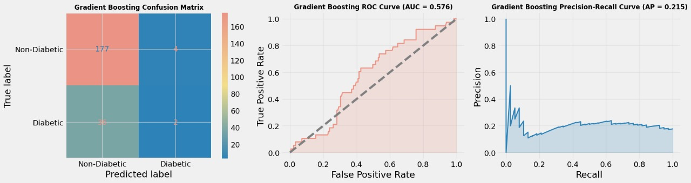
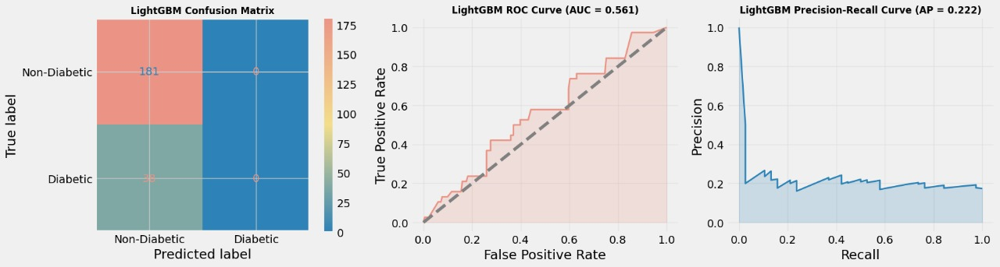
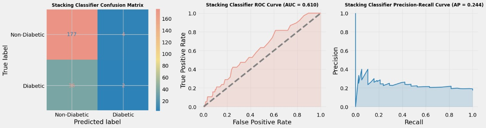
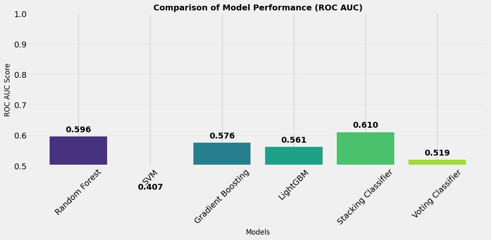

# 🌟 PPG Blood Glucose Diabetes Classification

Welcome to the **PPG Blood Glucose Diabetes Classification** project! 🎉  
This repository provides a pipeline for estimating blood glucose levels using **Photoplethysmography (PPG)** signals.  
By combining advanced signal processing, machine learning, and visualizations, we enable **non-invasive diabetes screening** for modern preventive healthcare. 🩺💡

---

## 📋 Project Overview

This project uses **PPG**—an optical technique for capturing blood volume changes—to **predict blood glucose levels non-invasively**.

The modular framework integrates signal engineering and machine learning, making it suitable for experimentation and real-world use.

### ✨ Key Features

- 📊 **Data Processing**: Preprocess raw PPG segments and extract physiological features  
- 🤖 **Machine Learning Models**: Random Forest, Gradient Boosting, SVM, LightGBM, Logistic Regression, and Ensemble Methods, Stacking and Voting Classifiers  
- 📈 **Visualizations**: ROC curves, confusion matrices, and feature importance plots  
- 🧪 **Evaluation**: Subject-wise StratifiedGroupKFold cross-validation to prevent data leakage and ensure real-world applicability  

---

## 📂 Project Structure

```
PPG_Blood_Glucose_JB_Implementation/
├── datasets/
│   ├── ppg_bagging_tree_features.csv
│   ├── ppg_specific_features.csv
│   ├── processed_metadata.csv
│   ├── PPG-BP.xlsx
│   └── 0_subject/
├── models/
│   ├── random_forest.pkl
│   ├── svm.pkl
│   └── ...
├── outputs/
│   ├── confusion_matrix_randomforest.png
│   ├── roc_randomforest.png
│   └── ...
├── src/
│   ├── excel_handling.py
│   ├── data_preprocessing.py
│   ├── train_models.py
│   └── evaluate.py
├── requirements.txt
└── README.md
```


---

## 🚀 Getting Started

Let’s get you up and running in no time!

### ✅ Prerequisites

- Python 3.8+ 🐍  
- pip (Python package manager)  
- Git 📦

---

### 🛠 Setup Instructions

#### 1. Clone the Repository

```bash
git clone https://github.com/Spidy104/PPG_DIABETES_CLASSIFICATION
cd PPG_DIABETES_CLASSIFICATION
```
#### 2. Set Up a Virtual Environment (Recommended)

```bash
python -m venv venv
```

#### 3. Activate the Virtual Environment

- **On macOS/Linux:**
    ```bash
    source venv/bin/activate
    ```
- **On Windows:**
    ```bash
    venv\Scripts\activate
    ```

#### 4. Install Dependencies

```bash
pip install -r requirements.txt
```

---

## 🧠 Usage Guide

### 📁 Step 1: Prepare the Data

Ensure the `datasets/` folder contains:

- `ppg_bagging_tree_features.csv` — Contains extracted features from PPG signals using bagging tree methods for model training.
- `ppg_specific_features.csv` — Includes domain-specific physiological features derived from PPG signals.
- `processed_metadata.csv` — Metadata for each sample, such as subject IDs, timestamps, and labels (e.g., glucose levels).
- `PPG-BP.xlsx` — Raw and reference data, including PPG signals and corresponding blood pressure/glucose measurements.
- `0_subject/` (Raw PPG signals by subject) — Directory with raw PPG signal files, organized per subject for preprocessing.
### ⚙️ Step 2: Process and Preprocess Data

#### 2.1 Process Excel Metadata

```bash
python src/excel_handling.py
```

#### 2.2 Preprocess Raw Data

```bash
python src/data_preprocessing.py
```
#### 2.3 Feature Extraction

```bash
python src/feature_extraction.py
```

### 🏋️ Step 3: Train the Models

Run the following command to train all machine learning models:

```bash
python src/train_models.py
```

This will generate model files in the `models/` directory:

```
models/
├── random_forest.pkl
├── svm.pkl
├── gradient_boosting.pkl
├── lightgbm.pkl
├── logistic_regression.pkl
├── stacking_classifier.pkl
└── voting_classifier.pkl
```

### 📊 Step 4: Evaluate and Visualize Results

Evaluate the trained models and generate visualizations:

```bash
python src/second_model.ipynb
```

Results and plots will be saved in the `outputs/` directory:

```plaintext
outputs/
├── gradient_boosting.jpg
├── LightGBM.jpg
├── Stacking_Classifier.jpg
├── Voting_Classifier.jpg
├── Model_performance.jpg
├── ROC_curves.jpg
```

---

## ✅ Example Outputs

Here’s a sneak peek at the insights you'll get:

### 🧾 Classification Report

Below are the classification reports for each model (Model 2):

#### Random Forest

| Class      | Precision | Recall | F1-Score | Support |
|------------|-----------|--------|----------|---------|
| 0          | 0.830     | 0.990  | 0.900    | 181     |
| 1          | 0.000     | 0.000  | 0.000    | 38      |
| **Accuracy**   |           |        | 0.820    | 219     |
| **Macro Avg**  | 0.410     | 0.500  | 0.450    | 219     |
| **Weighted Avg** | 0.680   | 0.820  | 0.750    | 219     |

#### SVM

| Class      | Precision | Recall | F1-Score | Support |
|------------|-----------|--------|----------|---------|
| 0          | 0.830     | 1.000  | 0.910    | 181     |
| 1          | 0.000     | 0.000  | 0.000    | 38      |
| **Accuracy**   |           |        | 0.830    | 219     |
| **Macro Avg**  | 0.410     | 0.500  | 0.450    | 219     |
| **Weighted Avg** | 0.680   | 0.830  | 0.750    | 219     |

#### Gradient Boosting

| Class      | Precision | Recall | F1-Score | Support |
|------------|-----------|--------|----------|---------|
| 0          | 0.830     | 0.980  | 0.900    | 181     |
| 1          | 0.330     | 0.050  | 0.090    | 38      |
| **Accuracy**   |           |        | 0.820    | 219     |
| **Macro Avg**  | 0.580     | 0.520  | 0.490    | 219     |
| **Weighted Avg** | 0.740   | 0.820  | 0.760    | 219     |

#### LightGBM

| Class      | Precision | Recall | F1-Score | Support |
|------------|-----------|--------|----------|---------|
| 0          | 0.830     | 1.000  | 0.910    | 181     |
| 1          | 0.000     | 0.000  | 0.000    | 38      |
| **Accuracy**   |           |        | 0.830    | 219     |
| **Macro Avg**  | 0.410     | 0.500  | 0.450    | 219     |
| **Weighted Avg** | 0.680   | 0.830  | 0.750    | 219     |

#### Stacking Classifier

| Class      | Precision | Recall | F1-Score | Support |
|------------|-----------|--------|----------|---------|
| 0          | 0.840     | 0.970  | 0.900    | 181     |
| 1          | 0.440     | 0.110  | 0.170    | 38      |
| **Accuracy**   |           |        | 0.820    | 219     |
| **Macro Avg**  | 0.640     | 0.540  | 0.540    | 219     |
| **Weighted Avg** | 0.770   | 0.820  | 0.770    | 219     |

#### Voting Classifier

| Class      | Precision | Recall | F1-Score | Support |
|------------|-----------|--------|----------|---------|
| 0          | 0.830     | 0.990  | 0.900    | 181     |
| 1          | 0.000     | 0.000  | 0.000    | 38      |
| **Accuracy**   |           |        | 0.820    | 219     |
| **Macro Avg**  | 0.410     | 0.500  | 0.450    | 219     |
| **Weighted Avg** | 0.680   | 0.820  | 0.750    | 219     |

### 📊 Gradient Boosting Performance



### 🧮 LightGBM Confusion Matrix



### 🤖 Stacking Classifier Results



### 🗳️ Voting Classifier Results


### 📈 Model Performance Comparison



### 🏅 ROC Curves for All Models


```

